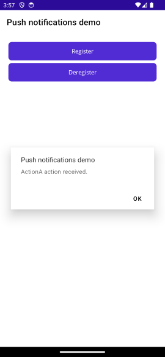
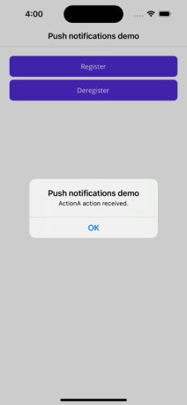

# Push notifications using Azure Notification Hubs via a backend service

Push notifications deliver information from a backend system to a client app. Apple, Google, and other platforms each have their own Push Notification Service (PNS). Azure Notification Hubs enable you to centralize notifications across platforms so that your backend app can communicate with a single hub, which takes care of distributing notifications to each PNS.

This sample demonstrates the use of Azure Notification Hubs via a backend service to send push notifications to Android and iOS apps built with .NET Multi-platform App UI (.NET MAUI).  An ASP.NET Core Web API backend is used to handle device registration for the client, and to initiate a push notification. These operations are handled using the [Microsoft.Azure.NotificationHubs](https://www.nuget.org/packages/Microsoft.Azure.NotificationHubs/) NuGet package.

Notifications will appear in the notification center when the app is stopped or in the background:

If a notification contains an action and is received when app is in the foreground, or where a notification is used to launch the application from notification center, a message is presented identifying the action specified:

In this sample, registration and de-registration is performed in response to user input, to allow this functionality to be explored and tested more easily. In a production app you would typically perform the registration and de-registration actions during the appropriate point in the app lifecycle, without requiring explicit user input.

## Prerequisites

To run this sample, you'll require:

- An [Azure account with an active subscription](https://azure.microsoft.com/free/dotnet/).
- A PC running the latest version of Visual Studio with the .NET Multi-platform App UI development workload and the ASP.NET and web development workloads installed.

For Android, you must have:

- A developer unlocked physical device, or an emulator, running API 26+ with Google Play Services installed.

For iOS, you must have:

- An active Apple developer Account.
- A Mac running Xcode, along with a valid developer certificate installed into your Keychain.

Then, on iOS you should either have:

- An iOS 16+ simulator that runs in macOS 13+ on Mac computers with Apple silicon or T2 processors.

  OR

- A physical iOS device that's registered to your developer account (running iOS 13.0+).
- Your physical device registered in your Apple developer account, and associated with your certificate.
- A *.p12* or *.p8* development certificate installed in your keychain, allowing you to run an app on a physical device.

> [!NOTE]
> The iOS simulator supports remote notifications in iOS 16+ when running in macOS 13+ on Mac computers with Apple silicon or T2 processors. If you don't meet these hardware requirements you'll require an active Apple developer account and a physical device.

Before running the sample you'll need to:

1. Create a Firebase project.
1. Register your iOS app for push notifications.
1. Create an Azure Notification Hub.
1. Configure the Azure Notification Hub to connect to an Apple Push Notification Service.
1. Configure the Azure Notification Hub to connect to Firebase Cloud Messaging.
1. Optionally publish the Web API backend service to Azure App Service as an API app.
1. Use the [Secret Manager tool](https://learn.microsoft.com/aspnet/core/security/app-secrets#secret-manager) to set values for `NotificationHub:Name`, `NotificationHub:ConnectionString`, and `Authentication:ApiKey`. Alternatively, if you publish the backend service to Azure App Service, these keys and values should be added to the app settings for the API app.
1. Update the mobile app config (*Config.cs* in the **PushNotificationsDemo** project) to use the api key and service endpoint values.
1. Update the `<ApplicationId>` value in the project file (.csproj) to match the value you defined when creating your Firebase project, and when registering your iOS app for push notifications.
1. Add your *google-services.json* file to the *Platforms/Android* folder of the **PushNotificationsDemo** project.
1. Ensure that the appropriate certificate and provisioning profile has been downloaded and is being used for bundle signing on iOS, if you intend to run the sample on a physical device.

For more information about this sample, including full instructions for all these steps, see [Send push notifications to .NET MAUI apps using Azure Notification Hubs via a backend service](https://learn.microsoft.com/dotnet/maui/data-cloud/push-notifications).
